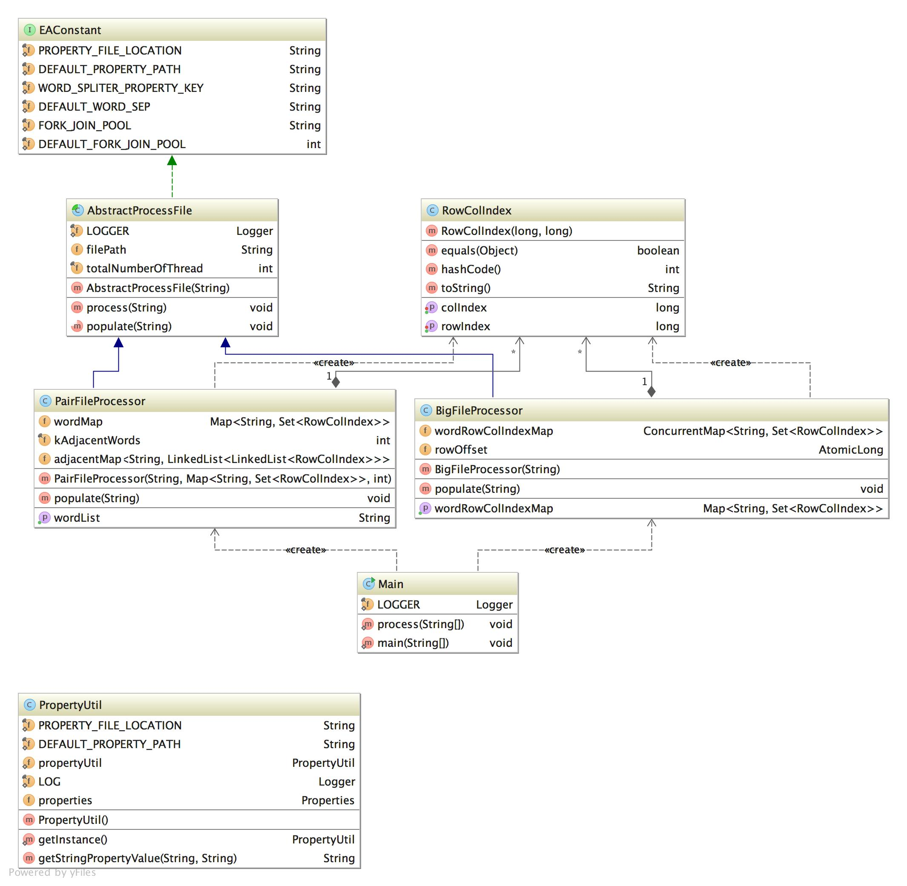

Problem Statement
============================
You have a text document, which is your input. We can assume A sample is given blow:
words.txt:
I am a software engineer.
And I am enjoying my work at EA.

For each word, you can identify it with a position (row number, column number).
For example, you have the following positions for "I":
(0, 0), (1, 1)

And another input of your program is a list of pairs of words, which is also stored in a text file:
pairs.txt:
I am
work at
EA And

For each pair, you have to determine whether they appear in the document adjacently
with the exact order and print out their positions (if they appear in multiple places).
The solution should be both time and space efficient, should also be scalable to process
big text file and long list of pairs of words, and finally should be easily expanded
to solve the problem of k adjacent words (k>2).

So your output for the sample inputs are:
I am : (0, 0) (0, 1); (1, 1), (1, 2);
work at: (1, 5), (1, 6);
EA And: null

Software Requirement
==========================
##### 1 JDK 1.8 (As I am using JDK 1.8 stream for Parallel processing)
##### 2 Maven 3.0.x

Build Instruction and Execution
==========================
##### 1 go to command prompt and pass the following command for building
    mvn clean install
##### 2 once build complete go to "target" folder and copy "EA-bin.tar" to the distnation folder
    cd target
    mkdir ~/releases
    cp EA-bin.tar ~/releases
##### 3 Finally extract EA-bin.tar into destination folder
    cd ~/releases
    tar -xvf EA-bin.tar

##### 4 finally execute the program using following command
    java -jar CodingChallange-1.0-SNAPSHOT.jar <<Big File Path>> <<Pair File Path>> [Optional number to denote K adjacent word]
    if not specified K adjacent word will be 2

 Class Diagram
============================

Approach
=======================
#### * Process Big File in parallel and for each line of the file perform these following operation
##### 1. Split the line into multiple words
##### 2. for each word put the coordinate list (rowIndex - which is line offset 0 based Index, and colIndex - 0 based index and incremented buy 1) in a concurrentHashMap

#### * Process Pair file in parallel and for each line perform the following operations
##### 1. Split line into multiple word and for each word in the line, check adjacency by investigating the row and col index from concurrentHashMap as provided by BigFileProcessor, ideally
    rowIndex of the new word = rowIndex of 1st word in the line
    colIndex of the new word = colIndex of the 1st word in the line + offset postion of the new word w.r.t the 1st word
##### 2. Finally add the new word's co-ordinate in LinkedList and put the linkedList for the all adjacent words
##### 3. In case the word list does not have K adjacent words or any of the words not  found to be adjacent as in the concurrentHashMap, it will return null co-ordinate

Assumption
=========================
##### 1. Assume all files are separated by space and not other delimiter.
##### 2. Duplicate line in the Pair File will be ignored.

Limitation
=============================
##### 1. Currently the Big File and Pair files are processed by multiple threads in single JVM. Total number is threads are controlled by CPU and cores available to the virtual machine.
##### 2. Perhaps this program can be converted into MapReduce program, where every map and reduce job will process chunk of file and emits the result and finally combined the final output.

Test cases
==============================
Currently 87% methods are covered by test cases.

##### 1. Test cases for Big File Processing
##### 2. Test cases for Pair File Processing
##### 3. Test cases for Main Method processing